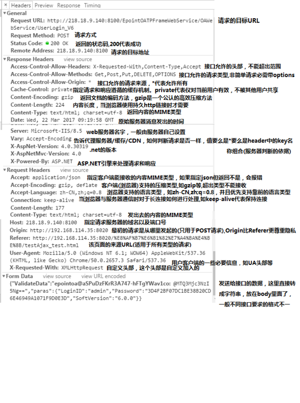

## 梳理主干流程
1. [从浏览器接收url到开启网络线程](#从浏览器接收url到开启网络线程) 【浏览器的机制以及进程与线程之间的关系】
2. [开启网络线程到发出一个完整的http请求](#开启网络线程到发出一个完整的http请求) 【dns查询，tcp/ip协议，五层英特网协议】
3. [从服务器接收到请求到对应后台接收请求](#从服务器接收到请求到对应后台接收请求) 【负载均衡，安全拦截以及后台内部处理】
4. [后端与前台http交互](#后端与前台http交互)【http请求头，报文结构，响应码，编码解码】
5. 单独拎出来的缓存问题，http的缓存（这部分包括http缓存头部，etag，catch-control等）
6. [浏览器接收到http数据包后的解析过程](#浏览器接收到http数据包后的解析过程) 【解析html-词法分析然后生成dom树，解析css生成css规则树，合并成render树，然后layout，painting渲染，复合图层的合成，cpu绘制，外链资源的处理，DOMContentLoaded和load】
7. [css的可视化格式模型](#css的可视化格式模型)【元素的渲染规则，如包含块，控制框，BFC,IFC等概念】
8. [js引擎执行机制](#js引擎执行机制)【js解释阶段，预处理阶段，执行阶段生成执行上下文，vo，作用域链，回收机制等】
9. 其他（可以拓展的不同知识模块，如跨域，web安全，hybrid模式等等内容）

## 从浏览器接收url到开启网络线程

这一部分展开的内容是：浏览器进程/线程模型，JS的运行机制
### 区分进程与线程
````
- 进程是一个工厂，工厂有它的独立资源

- 工厂之间相互独立

- 线程是工厂中的工人，多个工人协作完成任务

- 工厂内有一个或多个工人

- 工人之间共享空间
````
完善概念
````
- 工厂的资源 -> 系统分配的内存（独立的一块内存）

- 工厂之间的相互独立 -> 进程之间相互独立

- 多个工人协作完成任务 -> 多个线程在进程中协作完成任务

- 工厂内有一个或多个工人 -> 一个进程由一个或多个线程组成

- 工人之间共享空间 -> 同一进程下的各个线程之间共享程序的内存空间（包括代码段、数据集、堆等）
````

### 多进程的浏览器
浏览器是多进程的，有一个主控进程以及每一个tab页都会新开启一个进程（某些情况下多个tab会合并）

进程可能包括主控进程，插件进程，cpu，tab页（浏览器内核）等等

- Browser进程：浏览器的主进程（负责协调、主控），只有一个
- 第三方插件进程：每种类型的插件对应一个进程，仅当使用该插件时才创建
- GPU进程：最多一个，用于3D绘制
- 浏览器渲染进程（内核）：默认每个Tab页面一个进程，互不影响，控制页面渲染，脚本执行，事件处理等（有时候会优化，如多个空白tab会合并成一个进程）

如下图：


### 多线程的浏览器内核
每一个tab页可以看为浏览器的内核进程，这个进程是多线程的，它有几大子线程
- GUI线程
  + 负责渲染浏览器界面，解析HTML，CSS，构建DOM树和RenderObject树，布局和绘制等。
  + 当界面需要重绘（Repaint）或由于某种操作引发回流(reflow)时，该线程就会执行
  + 注意，GUI渲染线程与JS引擎线程是互斥的，当JS引擎执行时GUI线程会被挂起（相当于被冻结了），GUI更新会被保存在一个队列中等到JS引擎空闲时立即被执行。
- JS引擎线程
  + 也称为JS内核，负责处理Javascript脚本程序。（例如V8引擎）
  + JS引擎线程负责解析Javascript脚本，运行代码。
JS引擎一直等待着任务队列中任务的到来，然后加以处理，一个Tab页（renderer进程）中无论什么时候都只有一个JS线程在运行JS程序
  + 同样注意，GUI渲染线程与JS引擎线程是互斥的，所以如果JS执行的时间过长，这样就会造成页面的渲染不连贯，导致页面渲染加载阻塞。
- 事件触发线程
  + 归属于浏览器而不是JS引擎，用来控制事件循环（可以理解，JS引擎自己都忙不过来，需要浏览器另开线程协助）
  + 当JS引擎执行代码块如setTimeOut时（也可来自浏览器内核的其他线程,如鼠标点击、AJAX异步请求等），会将对应任务添加到事件线程中
  + 当对应的事件符合触发条件被触发时，该线程会把事件添加到待处理队列的队尾，等待JS引擎的处理
  + 注意，由于JS的单线程关系，所以这些待处理队列中的事件都得排队等待JS引擎处理（当JS引擎空闲时才会去执行）
- 定时器线程
  + 传说中的setInterval与setTimeout所在线程
  + 浏览器定时计数器并不是由JavaScript引擎计数的,（因为JavaScript引擎是单线程的, 如果处于阻塞线程状态就会影响记计时的准确）
  + 因此通过单独线程来计时并触发定时（计时完毕后，添加到事件队列中，等待JS引擎空闲后执行）
  + 注意，W3C在HTML标准中规定，规定要求setTimeout中低于4ms的时间间隔算为4ms。
- 网络请求线程
  + 在XMLHttpRequest在连接后是通过浏览器新开一个线程请求
  + 将检测到状态变更时，如果设置有回调函数，异步线程就产生状态变更事件，将这个回调再放入事件队列中。再由JavaScript引擎执行。

> js引擎线程是内核进程中的一个线程，所以说js引擎是单线程的。

### 解析url
url包含以下几大部分：
- protocol，协议头，譬如有http，ftp等
- host，主机域名或IP地址
- port，端口号
- path，目录路径
- query，即查询参数
- fragment，即#后的hash值，一般用来定位到某个位置

### 网络请求都是单独的线程
每次网络都需要开辟单独的线程进行，譬如如果URL解析到http协议，就会新建一个网络线程去处理资源下载

因此浏览器会根据解析出得协议，开辟一个网络线程，前往请求资源


##### 参考
- https://segmentfault.com/a/1190000012925872

**[⬆ 回到顶部](#梳理主干流程)**
## 开启网络线程到发出一个完整的http请求

这一部分主要内容包括：dns查询，tcp/ip请求构建，五层因特网协议栈等等

### DNS查询得到IP
如果输入的是域名，需要进行dns解析成IP，大致流程：

- 如果浏览器有缓存，直接使用浏览器缓存，否则使用本机缓存，再没有的话就是用host
- 如果本地没有，就向dns域名服务器查询（当然，中间可能还会经过路由，也有缓存等），查询到对应的IP

注意，域名查询时有可能是经过了CDN调度器的（如果有cdn存储功能的话）
### tcp/ip请求
http的本质就是tcp/ip请求，需要了解3次握手规则建立连接以及断开连接时的四次挥手

tcp将http长报文划分为短报文，通过三次握手与服务端建立连接，进行可靠传输
#### 三次握手的步骤（抽象）
````
客户端：hello！你是server吗？
服务器：hello！我是server，你是client吗？
客户端：yes，我是client
````
建立成功的连接后，接下来就正式传输数据，待到断开连接时，需要四次挥手（全双工???）
#### 四次挥手的步骤（抽象）
````
主动方：我已经关闭了向你那边的主动通道，只能被动接受了
被动方：收到通道关闭的消息
被动方：那我也告诉你，我想你那边的主动通道也关闭了
主动方：最后收到数据，之后双方无法通信
````
#### tcp/ip的并发限制
浏览器对同一域名下并发的tcp连接是有限制的（2-10个不等）

而且在http1.0中往往一个资源下载就需要对应一个tcp/ip请求

所以针对这个瓶颈，又出现了很多的资源优化方案???
#### get和post的区别
get和post虽然本质都是tcp/ip，但两者除了http层面，在tcp/ip层面也有却别。
get会产生一个tcp数据包，post产生两个
- get请求：浏览器会它header和data一起发出去，服务器响应200并返回数据
- post请求:浏览器会先发出header,服务器响应100 continue，浏览器再发送data，服务器响应200并返回数据

### 五层因特网协议
从客户端发出http请求到服务器接收，中间会经过一系列的流程。

从应用层发送http请求，到传输层经过三次握手建立tcp/ip连接，再到网络层ip寻址，再到数据链路层封装成帧，最后到物理层利用物理介质传输。

服务器的接收就是反过来的步骤。  

五层英特网协议内容：
````
1. 应用层（dns，http）dns解析ip并发送http请求
2. 传输层（tcp，udp）建立tcp连接（三次握手）
3. 网络层（Ip，ARP）Ip寻址
4. 数据链路层 （PPP）封装成帧
5. 物理层 （利用物理介质传输比特流）物理传输（传输的时候通过双绞线，电磁波等各种介质）
````

当然，其实也有一个完整的OSI七层框架，与之相比，多了会话层、表示层。

OSI七层框架：物理层、数据链路层、网络层、传输层、会话层、表示层、应用层

````
表示层：主要处理两个通信系统中交换信息的表示方式，包括数据格式交换，数据加密与解密，数据压缩与终端类型转换等

会话层：它具体管理不同用户和进程之间的对话，如控制登陆和注销过程
````
**[⬆ 回到顶部](#梳理主干流程)**
## 从服务器接收到请求到对应后台接收请求
服务端在接收到请求时，内部会进行很多的处理

这里由于不是专业的后端分析，所以只是简单的介绍下，不深入???

### 负载均衡
对于大型项目，由于并发访问量很大，所以往往一台服务器是吃不消的，一般会有若干台服务器组成一个集群，然后配置反向代理实现负载均衡

简单来说

**用户发起的请求都指向调度服务器（反向代理服务器，譬如安装了nginx控制负载均衡），然后调度服务器根据实际的调度算法，分配不同的请求给对应集群中的服务器执行，然后调度器等待实际服务器的HTTP响应，并将它反馈给用户**
## 后台的处理
一般后台都是部署到容器中的，所以一般为：
- 先是容器接收到请求（如tomocat容器）
- 然后对应容器中的后台程序接收到请求（如java程序）
- 然后就是后台会有自己的统一处理，处理完成后返回响应结果

概括

- 一般的后端是有统一的验证的，如安全拦截，跨域验证
- 如果这一步不符合规则，直接返回响应的http报文（如拒绝请求等）
- 然后当验证通过后，才会进入实际的后台代码，此时是程序接收到请求，然后执行（譬如查询数据库，大量计算等）
- 等程序执行完毕后，会返回一个http响应包（一般这一步也会经过多层封装）
- 然后就是将这个包从后端发送给前端，完成交互

**[⬆ 回到顶部](#梳理主干流程)**
## 后端与前台http交互
前后端交互时，http报文作为信息的载体，非常重要

### http报文结构
报文结构一般包括：通用头部，请求/响应头部，请求/响应体

##### 通用头部
包括如下：
````
Request Url: 请求的web服务器地址

Request Method: 请求方式
（Get、POST、OPTIONS、PUT、HEAD、DELETE、CONNECT、TRACE）

Status Code: 请求的返回状态码，如200代表成功

Remote Address: 请求的远程服务器地址（会转为IP）
````
譬如，在跨域拒绝时，可能是method为options，状态码为404/405等（当然，实际上可能的组合有很多）

其中，Method的话一般分为两批次：
````
HTTP1.0定义了三种请求方法： GET, POST 和 HEAD方法。
以及几种Additional Request Methods：PUT、DELETE、LINK、UNLINK

HTTP1.1定义了八种请求方法：GET、POST、HEAD、OPTIONS, PUT, DELETE, TRACE 和 CONNECT 方法。
````
- HTTP 1.0定义参考：https://tools.ietf.org/html/rfc1945
- HTTP 1.1定义参考：https://tools.ietf.org/html/rfc2616

列举常见状态码
````
200——表明该请求被成功地完成，所请求的资源发送回客户端
304——自从上次请求后，请求的网页未修改过，请客户端使用本地缓存
400——客户端请求有错（譬如可以是安全模块拦截）
401——请求未经授权
403——禁止访问（譬如可以是未登录时禁止）
404——资源未找到
500——服务器内部错误
503——服务不可用
...
````

不同范围状态码大致含义
````
1xx——指示信息，表示请求已接收，继续处理
2xx——成功，表示请求已被成功接收、理解、接受
3xx——重定向，要完成请求必须进行更进一步的操作
4xx——客户端错误，请求有语法错误或请求无法实现
5xx——服务器端错误，服务器未能实现合法的请求
````
##### 请求/响应头部
请求和响应头部也是分析时常用到的

常用的请求头部（部分）：

参数 | 说明
---|---
Accept|接收类型，表示浏览器支持的MIME类型（对标服务端返回的Content-Type）
Accept-Encoding |浏览器支持的压缩类型,如gzip等,超出类型不能接收
Content-Type|客户端发送出去实体内容的类型
Cache-Control| 指定请求和响应遵循的缓存机制，如no-cache
If-Modified-Since|对应服务端的Last-Modified，用来匹配看文件是否变动，只能精确到1s之内，http1.0中
Expires|缓存控制，在这个时间内不会请求，直接使用缓存，http1.0，而且是服务端时间
Max-age|代表资源在本地缓存多少秒，有效时间内不会请求，而是使用缓存，http1.1中
If-None-Match|对应服务端的ETag，用来匹配文件内容是否改变（非常精确），http1.1中
Cookie| 有cookie并且同域访问时会自动带上
Connection| 当浏览器与服务器通信时对于长连接如何进行处理,如keep-alive
Host|请求的服务器URL
Origin|最初的请求是从哪里发起的（只会精确到端口）,Origin比Referer更尊重隐私
Referer|该页面的来源URL(适用于所有类型的请求，会精确到详细页面地址，csrf拦截常用到这个字段)
User-Agent|用户客户端的一些必要信息，如UA头部等

常用的响应头部（部分）：

参数 | 说明
---|---
Access-Control-Allow-Headers| 服务器端允许的请求Headers
Access-Control-Allow-Methods| 服务器端允许的请求方法
Access-Control-Allow-Origin|服务器端允许的请求Origin头部（譬如为*）
Content-Type|服务端返回的实体内容的类型
Date|数据从服务器发送的时间
Cache-Control|告诉浏览器或其他客户，什么环境可以安全的缓存文档
Last-Modified|请求资源的最后修改时间
Expires|应该在什么时候认为文档已经过期,从而不再缓存它
Max-age|客户端的本地资源应该缓存多少秒，开启了Cache-Control后有效
ETag|请求变量的实体标签的当前值
Set-Cookie|设置和页面关联的cookie，服务器通过这个头部把cookie传给客户端
Keep-Alive|如果客户端有keep-alive，服务端也会有响应（如timeout=38）
Server|服务器的一些相关信息

一般来说，请求头部和响应头部是匹配分析的。

譬如，请求头部的Accept要和响应头部的Content-Type匹配，否则会报错

譬如，跨域请求时，请求头部的Origin要匹配响应头部的Access-Control-Allow-Origin，否则会报跨域错误

譬如，在使用缓存时，请求头部的If-Modified-Since、If-None-Match分别和响应头部的Last-Modified、ETag对应

还有很多的分析方法，这里不一一赘述

##### 请求/响应实体

http请求时，除了头部，还有消息实体，一般来说

请求实体中会将一些需要的参数都放入进入（用于post请求）。

譬如实体中可以放参数的序列化形式（a=1&b=2这种），或者直接放表单对象（Form Data对象，上传时可以夹杂参数以及文件），等等

而一般响应实体中，就是放服务端需要传给客户端的内容

一般现在的接口请求时，实体中就是对于的信息的json格式，而像页面请求这种，里面就是直接放了一个html字符串，然后浏览器自己解析并渲染。

需要补充，详细解释http协议???

如下图是对某请求的http报文结构的简要分析


**[⬆ 回到顶部](#梳理主干流程)**

## 浏览器接收到http数据包后的解析过程

##### 流程简述

浏览器内核拿到内容后，渲染步骤大致可以分为以下几步：
````
1. 解析html，构建dom树
2. 解析css，生成规则树
3. 合并dom树和css规则，生成render树
4. 布局render树（Layout/reflow），负责各元素尺寸，位置的计算
5. 绘制render树，绘制页面像素信息
6. 浏览器将各层的信息发送给CPU，CPU将各层合成（composite），显示到屏幕上
````
**[⬆ 回到顶部](#梳理主干流程)**
